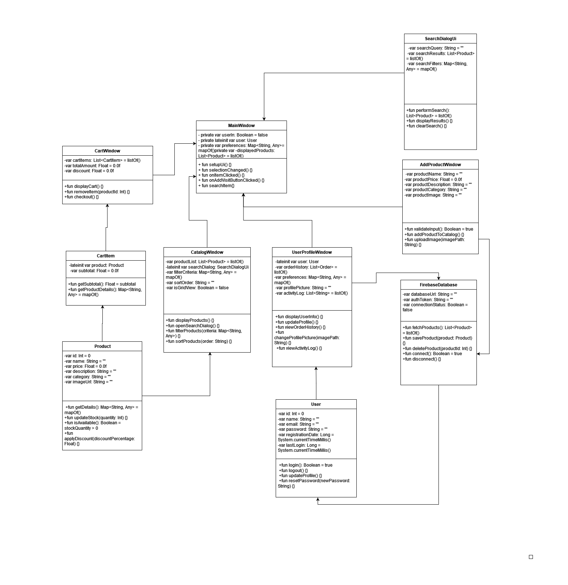

# Диаграмма классов  

# Глоссарий

| Класс | Описание |
|:---|:---|
|MainWindow	| Главное окно приложения
|CatalogWindow|	Окно каталога рецептов
|AddProductDialogUi|	Диалоговое окно добавления рецепта
|UserProfileWindow|	Окно профиля пользователя
|Product|	Класс рецепта
|User|	Класс пользователя
|FirebaseDatabase|	Класс для взаимодействия с Firebase (хранение и получение данных о товарах)
|SearchDialogUi|	Диалоговое окно поиска товара
